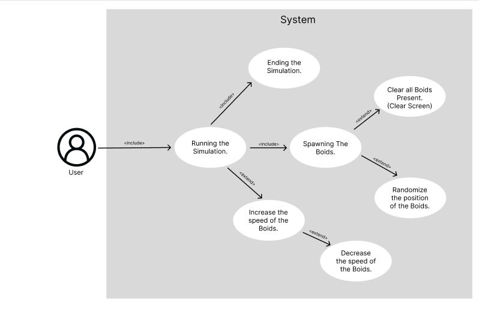
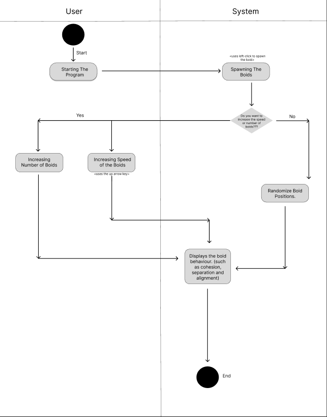
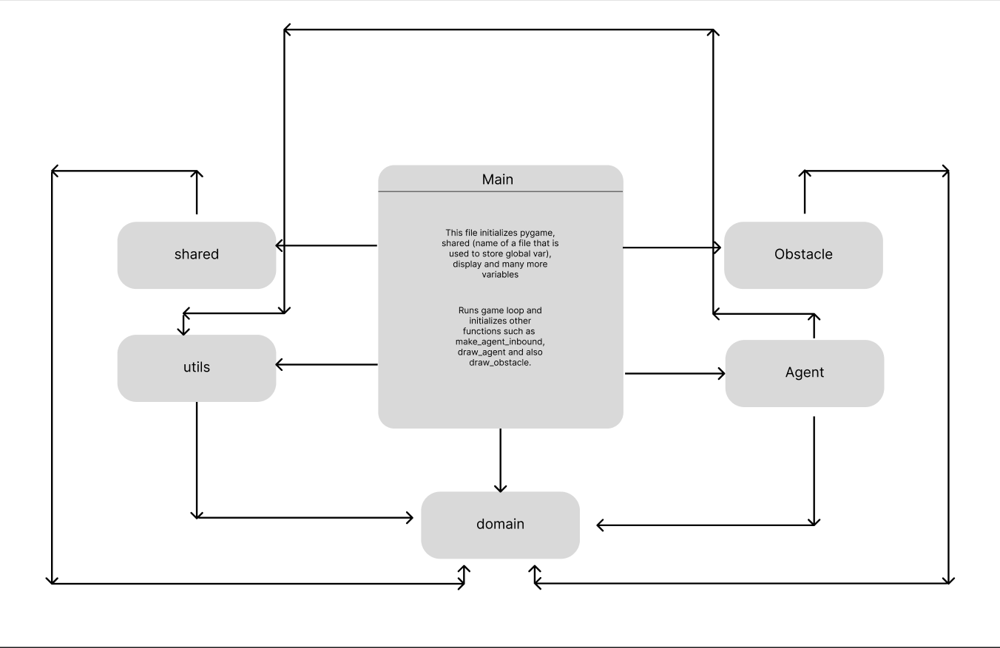
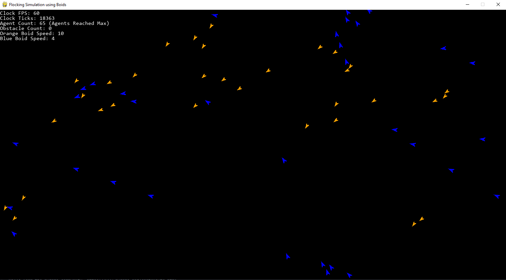

# Project Documentation

## Brief Description

This Project focuses on making a Boid Simulation. In short terms, a boid simulation projects the behaviour of flocking using a 2D/3D model of an artificial life program called boid (bird-oid). The boid simulation was first implemented by Craig Reynolds in 1986. In this program, I will be simulating the main 3 behaviour of a simple boid simulation which includes:

- Separation: A behaviour where the boid steer to avoid local flockmates.

- Alignment: A behaviour where the boid steer towards the average heading of the flock.

- Cohesion: A behaviour where the boid steer towards the average position of the local flockmates (Center of mass).


#  Use-case Diagram




#  Activity Diagram



# Class Diagram




# Modules Used

- Pygame: Pygame has a number of features for this program such as initializing the screen, displaying the simulation and also displaying certain settings such as clock ticks and fps.

- sys: sys is mostly used to exit out of the pygame window, the additional usage for this module is to import fonts for the settings on the simulation.

- math: math has a lot of functions in order to help with the simulation itself.

- random: random has a function called "randrange()' which is used to return a randomly selected element from a specified range.


# Essential Algorithms

```py
# Simulation Environment

from utils import v_sub, v_add, v_mul, v_div, v_array_sum, agent_degree_rotation, convert_to_unit_vector, limit
from Agent import DEFAULT_SPEED, Agent
from Obstacle import Obstacle
import shared
from random import randrange

# Blue Agent:0
# Red Agent:1
ALIGNMENT_WEIGHT = [10,4]
COHESION_WEIGHT = [5,3]
SEPERATION_WEIGHT = [5,8]
OBSTACLE_DOGDGE_WEIGHT = 180

ALIGNMENT_RADIUS = 200
COHESION_RADIUS = 170
SEPERATION_RADIUS = 30
OBSTACLE_DOGDGE_RADIUS = 70

MAX_SPEED = 25
MIN_SPEED = 1

def compute_alignment(myAgent,t):
    compute_vel = (0,0)
    neighbors_count = 0

    for i in range(len(shared.agent_array)):
        agent = shared.agent_array[i]
        if agent != myAgent and myAgent.distance_from(agent) < ALIGNMENT_RADIUS and t == i%2:
            compute_vel = v_add(compute_vel,agent.vel)
            neighbors_count+=1

    if neighbors_count == 0:
        return compute_vel

    compute_vel = v_div(compute_vel,neighbors_count)

    return limit(compute_vel,0.05)

def compute_seperation(myAgent,t):
    compute_vel = (0,0)
    neighbors_count = 0

    for i in range(len(shared.agent_array)):
        agent = shared.agent_array[i]
        if agent != myAgent and myAgent.distance_from(agent) < SEPERATION_RADIUS and t == i%2:
            temp_vel = v_sub(myAgent.pos,agent.pos)
            temp_vel = convert_to_unit_vector(temp_vel)
            compute_vel = v_add(compute_vel, v_div(temp_vel,myAgent.distance_from(agent)))
            neighbors_count+=1

    if neighbors_count == 0:
        return compute_vel

    return v_div(compute_vel,neighbors_count)

def compute_cohesion(myAgent,t):
    compute_vel = (0,0)
    neighbors_count = 0

    for i in range(len(shared.agent_array)):
        agent = shared.agent_array[i]
        if agent != myAgent and myAgent.distance_from(agent) < COHESION_RADIUS and t == i%2:
            compute_vel = v_sub(agent.pos,myAgent.pos)
            neighbors_count+=1

    if neighbors_count == 0:
        return compute_vel

    compute_vel = v_div(compute_vel,neighbors_count)

    return limit(compute_vel, 0.05)


def compute_obstacle_dodge(myAgent):
    compute_vel = (0,0)
    neighbors_count = 0

    for obs in shared.obstacle_array:
        if obs.distance_from(myAgent) < OBSTACLE_DOGDGE_RADIUS:
            temp_vel = v_sub(myAgent.pos,obs.pos)
            temp_vel = convert_to_unit_vector(temp_vel)
            compute_vel = v_add(compute_vel, v_div(temp_vel,myAgent.distance_from(obs)))
            neighbors_count+=1

    if neighbors_count == 0:
        return compute_vel

    return v_div(compute_vel,neighbors_count)

def check_agent_inbound():
    for agent in shared.agent_array:
        if agent.pos[0] > shared.WIDTH:
            agent.pos = (0,agent.pos[1])
        if agent.pos[0] < 0:
            agent.pos = (shared.WIDTH,agent.pos[1])
        if agent.pos[1] > shared.HEIGHT:
            agent.pos = (agent.pos[0],0)
        if agent.pos[1] < 0:
            agent.pos = (agent.pos[0],shared.HEIGHT)

def agent_update():

    temp_agent_array = []

    for i in range(len(shared.agent_array)):
        agent = shared.agent_array[i]
        temp_vel = (0,0)
        cohesion_v = compute_cohesion(agent,i%2)
        alignment_v = compute_alignment(agent,i%2)
        seperation_v = compute_seperation(agent,i%2)
        obstacle_dodge_v = compute_obstacle_dodge(agent)

        v_array = [agent.vel,
                   v_mul(cohesion_v,COHESION_WEIGHT[i%2]),
                   v_mul(alignment_v,ALIGNMENT_WEIGHT[i%2]),
                   v_mul(seperation_v,SEPERATION_WEIGHT[i%2]),
                   v_mul(obstacle_dodge_v, OBSTACLE_DOGDGE_WEIGHT)
                   ]


        temp_vel = v_array_sum(v_array)
        temp_vel = v_mul(temp_vel,shared.FPS)

        a = Agent(agent.pos, temp_vel)
        if i%2:
            a.vel = limit(temp_vel, DEFAULT_SPEED + 6 + shared.speed_adjustment)
        else:
            a.vel = limit(temp_vel, DEFAULT_SPEED + shared.speed_adjustment)
        # change_vel_if_zero(a)
        a.update_pos()
        temp_agent_array.append(a)

    shared.agent_array = temp_agent_array

def randomize_position():
    for agent in shared.agent_array:
        agent.pos = randrange(0,shared.WIDTH,1), randrange(0,shared.HEIGHT,1)

def clear_all_item():
    shared.agent_array = []
    shared.obstacle_array = []

def adjust_speed(type):
    if type:
        shared.speed_adjustment += 1
    else:
        shared.speed_adjustment -= 1

    if shared.speed_adjustment > MAX_SPEED:
        shared.speed_adjustment = MAX_SPEED
    elif shared.speed_adjustment < MIN_SPEED:
        shared.speed_adjustment = MIN_SPEED

```


```python
from math import sqrt
from utils import v_add

DEFAULT_SPEED = 4

class Agent(object):

    def __init__(self,pos = (1,1), vel=(DEFAULT_SPEED,0)):
        self.pos = (pos[0],pos[1])
        self.vel = vel

    def update_pos(self):
        self.pos = v_add(self.pos,self.vel)

        
    def distance_from(self,other_agent):
        return sqrt((other_agent.pos[0] - self.pos[0])**2 + (other_agent.pos[1] - self.pos[1]) **2)


```

```py
from math import sqrt

class Obstacle(object):

    def __init__(self,pos):
        self.pos = pos
        self.width = 20

    def distance_from(self,other_agent):
        return sqrt((other_agent.pos[0] - self.pos[0])**2 + (other_agent.pos[1] - self.pos[1]) **2)
```

#  Screenshots of your application




# Lesson Learned

Overall, I am quite happy with the results of my final project. I have learned a lot of things over the past months in order to create this final project such as properly implementing OOP using classes, importing one file to another file and also using modules which enables a wide variety of ideas to be made as the creativity is extended. Ultimately, I wanted to thank my classmates for their continuous support whenever I struggle with any problems that I can’t overcome.
